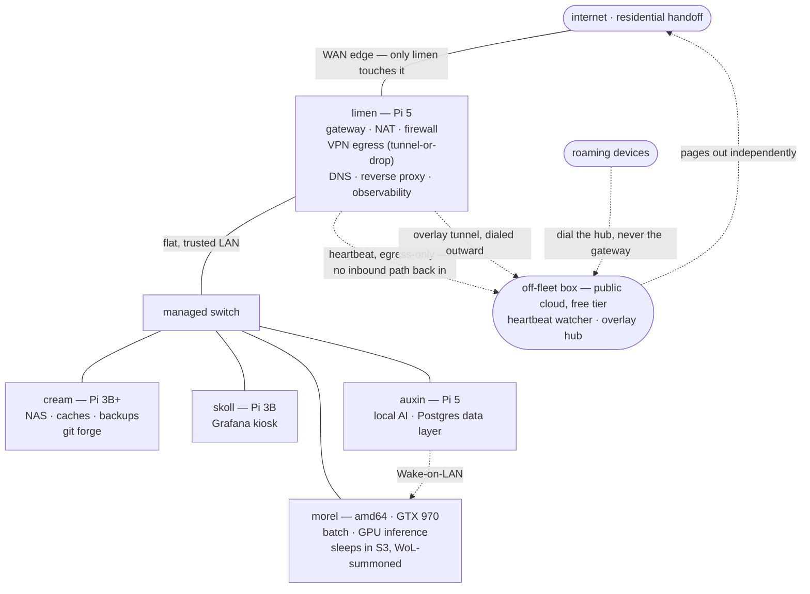

# Architecture overview

fangs is a five-node cluster — four Raspberry Pis plus one amd64 workhorse — that
behaves like a miniature, fully self-hosted network: its own gateway, its own DNS, its own VPN egress, its own
internal certificate authority, and its own observability stack. The LAN core has
one upstream dependency, a residential internet handoff, and one deliberate cloud
exception: a small off-fleet box (see below) that notices when the fleet itself
goes dark, and doubles as the fixed point the fleet's remote-access overlay dials
out to.

## Shape of the system

Only `limen` touches the WAN. The others are peers on a single flat LAN —
deliberately trusted, because the security boundary that matters is the WAN edge,
not host-to-host. (See *design principles* below.) The off-fleet box is
deliberately drawn separate: it shares no failure domain with the LAN side at
all — see *outside the house*, below.

## Outside the house

### Watching from outside

Every alerting layer inside the LAN shares one weakness: if the gateway itself
goes dark, so does its ability to say so. The fix isn't a bigger alerting stack
on the gateway — it's a second, independent witness that lives entirely outside
the house's network and power. It works as a dead-man's switch, not a poller:
the gateway pushes it a periodic heartbeat over its own outbound-only egress —
nothing reaches back in, so the fail-closed WAN posture above holds unchanged —
and the watcher pages out over its own path if that heartbeat ever stops
arriving. A third-party uptime pinger checks on *that* watcher in turn, so no
single link in the chain is un-watched. It is deliberately as small and
stateless as possible: the moment it needs deep observability of its own,
that's a sign it has taken on too much and stopped being a watcher.

### The fixed point everything dials out to

The same box has a second job. The gateway's own address on the wider internet
drifts, so rather than anyone dialing *in* to the house, every remote device —
and the gateway itself — dials *out* to the off-fleet box's fixed address, which
relays a split-tunnel WireGuard overlay between them. The gateway accepts no
inbound connection for remote access at all; the hub is the only thing that has
to be findable ([the road that never left the house](../log/2026-08-wireguard-hub.md)).

That second job strains the "as small as possible" rule above, and the fleet
answers it honestly rather than pretending otherwise: the box now reports basic
host and tunnel-health metrics back through the tunnel onto the fleet's own
dashboards, because a relay that silently stops forwarding looks exactly like a
working one until traffic needs it. Those metrics are deliberately *board-only* —
a down hub shows on its own dashboard and never pages — because the heartbeat
chain above already owns the question "is the outside witness alive?"

The box has moved more than once — torn down when its first job was done,
rebuilt when the second appeared, and finally settled on free-tier capacity — and
the design survived each move because nothing on the LAN depends on *which* box
it is, only on its name. A second, more capable free-tier box sits provisioned
and idle beside it, held in reserve for a future outward-facing job rather than
spent on the first plausible one.

## Design principles

**One gateway, everything behind it.** A single node owns routing, firewalling,
DNS, and VPN egress. That concentrates the security-relevant config in one place
and keeps the other nodes simple — they're just services on a LAN.

**Tunnel-or-drop egress.** All client traffic leaves through a VPN tunnel. The
kill switch isn't a feature toggle in the VPN client — it's the *structure* of
the firewall: the forward chain only permits egress via the tunnel interface, so
if the tunnel is down, traffic has nowhere to go. Fail-closed by construction.

**Visibility over least-privilege, inside the LAN.** On a trusted home network,
the scarce resource is insight, not isolation. Nodes carry generous read access
and ship metrics and logs freely. Hardening effort is spent on the WAN edge,
where it counts, not on locking peers away from each other.

**Reproducible from bare metal.** Every node is described in Ansible. A node can
be wiped and reflashed and come back with the same identity and the same address,
because addressing is pinned by hardware (DHCP reservations keyed to each NIC),
not hand-configured per host. Reflash, re-run the playbook, done.

**Idempotent convergence.** Roles are written to converge from *any* prior state,
not just a clean image — re-running changes nothing once the system matches the
desired state. This is harder than it sounds (see the
[WiFi failover build log](../log/2026-06-wifi-failover.md) for a war story) but
it's what makes the fleet trustworthy to re-apply at any time.

**Caching and self-sufficiency.** A node on the LAN serves a package cache and an
internal image registry, so rebuilds don't hammer the internet and the fleet
keeps working through upstream hiccups. (See [NAS & caching](nas-caching.md).)

## Build order

Dependencies dictate sequence, not preference:

1. **Gateway** — networking foundation everything else needs.
2. **NAS / caching** — storage and the package/image caches that speed up the rest.
3. **Observability** — last, so there are already targets to scrape and logs to ship.
4. **Local AI / data layer** — found its role: on-device LLM inference plus a
   Postgres + pgvector data layer (see [Local AI](local-ai.md) and
   [Data layer](data-layer.md)).
5. **Batch / GPU** — joined later as summoned muscle, sleeping until woken by
   Wake-on-LAN from the data-layer node.
6. **Off-fleet box** — added last and deliberately independent of the build
   order above; it doesn't depend on the fleet, the fleet depends on it existing —
   first as the outside witness, now also as the overlay hub remote access rides on.
